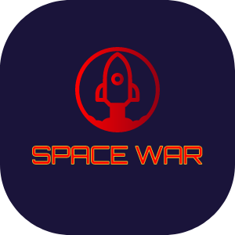
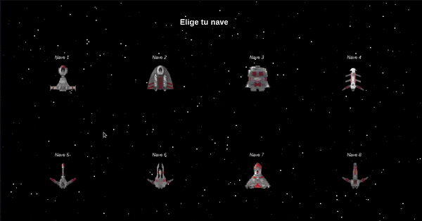

<div align="center" style="display: inline; vertical-align: middle;">


<br>
<b>Space War</b>

---



### 🚀 A space odyssey — originally written in Java, now playable in the browser via Rust + WebAssembly!

---

 

</div>

---

## 🌐 Play Online

The game is deployed to **GitHub Pages** and is playable directly in your browser — no install required.

> **[▶ Play Space War](https://lassault.github.io/SpaceWar/)**

---

## 🎮 How to Play

| Action | Control |
|---|---|
| Move ship | Mouse (or touch-drag on mobile) |
| Fire | Spacebar (or tap on mobile) |
| Select ship | Keys **1 – 8** |

The ship upgrades automatically as your score increases every 250 points (up to level 8).  Destroy enemies to earn points; survive with your 3 lives!

---

## 🗂️ Repository Structure

```
SpaceWar/
├── src/lassa/net/          # Original Java source (Swing/AWT desktop app)
│   └── imagenes/           # All game sprites (shared with web version)
├── spacewar-wasm/          # Rust + WebAssembly rewrite
│   ├── src/lib.rs          # Complete game logic in Rust
│   ├── Cargo.toml
│   └── www/                # Web-deployable folder
│       ├── index.html      # Game page (single file, no bundler needed)
│       └── assets/         # Sprites served as static files
└── .github/workflows/
    └── deploy-pages.yml    # CI/CD: builds WASM → deploys to GitHub Pages
```

---

## 🦀 Web Version — Rust + WebAssembly

### Why Rust + WebAssembly?

| Concern | Answer |
|---|---|
| **Performance** | Rust compiles to near-native speed WASM; no GC pauses |
| **Safety** | Memory-safe by default — no null-pointer crashes |
| **Portability** | Runs in any modern browser without plugins |
| **Portfolio fit** | Demonstrates both systems programming and web skills |

### Architecture

```
┌─────────────────────────────────────┐
│  Browser                            │
│  ┌─────────────┐  ┌───────────────┐ │
│  │  index.html │  │ spacewar_wasm │ │
│  │  (JS glue)  │◄─│  .wasm (54 KB)│ │
│  │             │  │               │ │
│  │ • load imgs │  │ • game state  │ │
│  │ • RAF loop  │  │ • physics     │ │
│  │ • events    │  │ • collisions  │ │
│  └──────┬──────┘  │ • rendering   │ │
│         │  Canvas │   (web-sys)   │ │
│         └────────►└───────────────┘ │
└─────────────────────────────────────┘
```

- **`SpaceWarGame::tick(timestamp)`** — called each animation frame; runs all physics, AI, and renders to the HTML5 Canvas.  
- **`SpaceWarGame::on_key_down(key, code)`** — keyboard input forwarded from JS.  
- **`SpaceWarGame::on_mouse_move(x, y)`** — mouse/touch position forwarded from JS.

### Building Locally

```bash
# Prerequisites: Rust stable, wasm-pack
rustup target add wasm32-unknown-unknown
cargo install wasm-pack

# Build
cd spacewar-wasm
wasm-pack build --target web --out-dir www/pkg

# Serve (any static file server works)
cd www
python3 -m http.server 8080
# Open http://localhost:8080
```

---

## ☕ Original Java Version

The original desktop game (`src/`) is a pure **Java Swing/AWT** application using multi-threading for movement, collision detection, enemy generation, and rendering.

```bash
# Run the pre-built JAR
java -jar SpaceWar.jar
```

